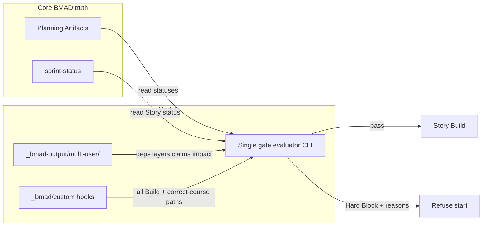
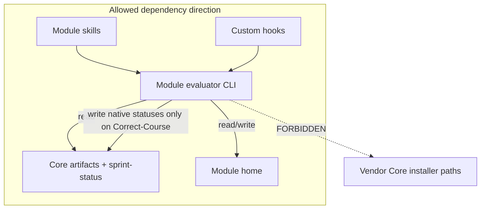

# Architecture Spine — BMAD Multi-User

## Design Paradigm

**Preflight-gate over shared truth.** The Module does not orchestrate BMAD workflows and does not own a derived readiness index as source of truth. It **reads** Core BMAD Planning Artifacts + sprint status, plus thin Module-owned git state, and **Hard-Blocks** Build / coherent-merge until Dependency Gates and open impact reviews pass.



## Invariants & Rules

### AD-1 — Preflight-gate paradigm [ADOPTED]

- **Binds:** all Module capabilities
- **Prevents:** AI-DLC-style orchestrator engine; derived SoT index dual-writing readiness away from `_bmad-output`
- **Rule:** Module may only evaluate and gate; it must not become a second methodology runtime or replace git / Core BMAD process ownership

### AD-2 — Core composition via custom hooks [ADOPTED]

- **Binds:** FR-6, FR-9, FR-11, FR-12, NFR-1
- **Prevents:** Core vendor edits; Hard Block that exists only on optional wrapper skills; git-hook enforcement of gates; ungated alternate Build skills
- **Rule:** Hard Block attaches through `_bmad/custom/*.toml` hooks (`activation_steps_prepend` and equivalents) on **every** Module-supported Story execution entrypoint that starts implementation work — at minimum `bmad-build` and `bmad-build-auto` — plus `bmad-correct-course`. Module UX skills handle status/claim/deps declaration. Wrappers must not be the sole gate. Git commit/push stay unrestricted

### AD-3 — Single Module home under `_bmad-output` [ADOPTED]

- **Binds:** FR-1, FR-2, FR-5, FR-7, FR-9, NFR-6
- **Prevents:** Module fields scattered into Story/PRD frontmatter as primary SoT; side-root outside `_bmad-output`
- **Rule:** All Module-owned state (deps, Layer Order, Claims, impact-review signal, readiness-map overrides) lives in one tree under `_bmad-output/` (seed path: `multi-user/`). Plain text in git: YAML preferred; JSON allowed (NFR-6); Markdown allowed for impact-review **prose appendix only** (see AD-9)

### AD-4 — Write ownership [ADOPTED]

- **Binds:** F2, FR-10, NFR-1
- **Prevents:** Parallel lifecycle enums; unauthorized Core / vendor mutation
- **Rule:** Module home = Module skills/scripts write only. Planning Artifacts = humans + Core write; Module reads statuses only. `sprint-status` / Story status = humans + Core; Module may write Story status only via explicit Correct-Course / recalc using **native** BMAD status values. After recalc invalidates executable work, move affected Stories to a **non-executable native** status (project picks among Core vocab, typically `backlog` — never invent `blocked` as a Module enum). Installer-owned Core paths = never

### AD-5 — Single gate evaluator [ADOPTED]

- **Binds:** FR-4, FR-5, FR-6, FR-8, FR-9, NFR-5
- **Prevents:** Divergent pass/fail across Build hooks, status report, coherent-merge check, and Correct-Course recalc
- **Rule:** One shared Python package exposes **one** CLI (or one library API with a single thin CLI) that implements Hard Block rules for Dependency Gates, Layer Order, enrollment, Planning Artifact readiness, and open impact-review. Status report, Build hooks, and coherent-merge checks must invoke that same entrypoint — no forked gate scripts

### AD-6 — Dependency enrollment as per-Story files [ADOPTED]

- **Binds:** FR-5, FR-6
- **Prevents:** Missing SoT for deps; incompatible dep homes; id mismatch with Claims
- **Rule:** Each Story in `sprint-status` must have `deps/<story-id>.yaml` under Module home. `<story-id>` **must equal** the `sprint-status` key. File declares `depends_on_stories`, `depends_on_artifacts`, `layer`, or explicit `none`. Missing file = incomplete = Hard Block. Cycle checks scan the deps tree. Layer membership for gating is declared **only** here (not duplicated as a second story→layer map)

### AD-7 — Layer Order default + audited loosen exceptions [ADOPTED]

- **Binds:** FR-7, FR-8
- **Prevents:** Silent Hard Block bypass; global `strict|relaxed` escape hatch; split story→layer SoT
- **Rule:** `layer-order.yaml` holds the ordered Layer name list + named loosen exceptions only (`story` id matching sprint-status, relaxed earlier-layer constraints, `reason`, `approved_by`). Invalid or cyclic Layer **order** declarations are rejected. Default gate: Story in Layer _L_ Hard-Blocked until every `sprint-status` Story whose deps file names a strictly earlier Layer is status `done` (native). Tighten only via FR-5 deps. Loosen only via those exceptions. Readiness maps (AD-10) must not redefine Story `done` for this rule

### AD-8 — Claims soft-check registry [ADOPTED]

- **Binds:** FR-1, FR-2
- **Prevents:** Dual claim ledgers; hard-lock scope creep; id drift vs deps
- **Rule:** Central Module-home Claims registry (`claims.yaml` or small path-prefix set). Claim targets use the same Story ids as `sprint-status` when claiming a Story slice; path claims use repo-relative paths. Soft-check warns on intersecting Module-mediated edits and on Build/status preflight. Never hard-locks git. No per-path `.claim` sidecar as primary SoT. Conventions docs must cover Planning Artifact folders **and** high-churn shared status files (e.g. sprint-status)

### AD-9 — Correct-Course always + impact-review signal [ADOPTED]

- **Binds:** FR-9, FR-10
- **Prevents:** Silent Project Truth drift from skipped “small” changes; ambiguous chat “review done”; dual open|cleared files
- **Rule:** Every `bmad-correct-course` run (via custom hook) requires impact review + status recalc in v1 (resolves PRD OQ1: “significant” = any Correct-Course run). Canonical coherent-merge / Build-ready signal is **`impact-review.yaml`** with affected items and `status: open|cleared`. Optional Markdown prose must not carry authoritative open|cleared. Hard Block while any required impact review is `open`. Coherent-merge checks use the same evaluator CLI (AD-5)

### AD-10 — Native status readiness map [ADOPTED]

- **Binds:** F2, FR-3, FR-4
- **Prevents:** Invented `draft|review|ready` vocabulary; per-Story ad-hoc ready thresholds; Story-layer rules loosened via map
- **Rule:** Module ships default artifact-kind → acceptable **native** BMAD statuses map covering at least PRD, UX Design/Experience, and Architecture (brief/spec kinds included as shipped defaults). Project may override in Module home config. Map applies to **Planning Artifact** (and declared artifact) readiness only — not to FR-8 Story Layer `done` checks. Module must not invent parallel Planning Artifact lifecycle enums

### AD-11 — Complementary module package [ADOPTED]

- **Binds:** F6, FR-11, FR-12, NFR-1, NFR-2, NFR-4, NFR-8
- **Prevents:** Ad-hoc skills-only drops; SaaS/network coupling; silent Core forks
- **Rule:** Ship as installable complementary BMAD module (skills + scripts + template `_bmad/custom` hooks). Offline for F1–F5. Semver Module-home schema and gate behavior; incompatible changes bump major and ship migration note. Declare supported Core BMAD major(s); breaking Core upgrades documented, not patched around. Install path includes a smoke check proving installer-owned Core vendor files were not modified

### AD-12 — Fast preflight cost [ADOPTED]

- **Binds:** NFR-3, SM-C1
- **Prevents:** Gate ceremony that meaningfully inflates standard BMAD workflow time
- **Rule:** Gate and status checks on Story start / Build preflight must stay a normal fast local preflight (no mandatory network, no separate multi-step human ceremony). No numeric wall-clock SLA in v1; optional SM-C1 measurement proxy remains pilot ops (Deferred)



## Consistency Conventions

| Concern               | Convention                                                                                                                                                                                        |
| --------------------- | ------------------------------------------------------------------------------------------------------------------------------------------------------------------------------------------------- |
| Naming                | Story ids everywhere (deps filenames, Claims Story slices, impact-review items, Layer exceptions) = `sprint-status` keys                                                                          |
| Data & formats        | Module home: YAML preferred, JSON allowed; impact-review authoritative file = `impact-review.yaml`; gate results: machine-readable + human-readable reasons (NFR-5); dates ISO-8601 in registries |
| State & cross-cutting | Mutation only per AD-4; evaluator non-zero / blocked lists failing conditions; no secrets beyond Core/git (NFR-7); config overrides in Module home only                                           |
| Enforcement surface   | Gates on Module-composed Build / Correct-Course / coherent-merge via AD-5 CLI — never required git hooks for Hard Block                                                                           |
| Ownership conventions | Document Planning Artifact layout + who may edit high-churn status files under soft Claims                                                                                                        |

## Stack

| Name                 | Version                                                                      |
| -------------------- | ---------------------------------------------------------------------------- |
| Python               | >=3.11                                                                       |
| uv                   | ~0.12.x (verified 2026-09; current line 0.12.x)                              |
| Module state formats | YAML preferred; JSON allowed; Markdown prose appendix for impact review only |
| Host platform        | Local git repo + Core BMAD install (no SaaS runtime)                         |
| Composition surface  | BMAD `_bmad/custom/*.toml` skill hooks                                       |

## Structural Seed

```text
_bmad-output/multi-user/          # Module home (seed name; single home invariant holds if renamed)
  config.yaml                     # readiness-map overrides, project settings
  layer-order.yaml                # ordered Layer names + loosen exceptions (no story→layer map)
  claims.yaml                     # Ownership soft-check registry
  deps/<story-id>.yaml            # enrollment + depends_on_* + layer membership
  impact-review.yaml              # authoritative open|cleared coherent-merge signal

_bmad/custom/                     # team hooks wiring Module preflight into Core skills
  bmad-build.toml
  bmad-build-auto.toml
  bmad-correct-course.toml

<module-package>/                 # installable complementary module
  skills/                         # UX: status, claim, declare deps, Correct-Course assist
  scripts/                        # single evaluator CLI + claim/status helpers (uv run)
```

**Operational envelope:** no cloud deploy topology — Module runs offline in the project git tree. “Environments” = declared compatible Core BMAD major versions (NFR-2) on Pilot machines/CI that already run BMAD.

## Capability → Architecture Map

| Capability / Area                         | Lives in                                                                                    | Governed by       |
| ----------------------------------------- | ------------------------------------------------------------------------------------------- | ----------------- |
| F1 Ownership / structure (FR-1, FR-2)     | Module home `claims.yaml` + conventions (incl. high-churn status files); soft-check scripts | AD-3, AD-8        |
| F2 Native status visibility (FR-3, FR-4)  | Evaluator reads Core statuses; status report via AD-5 CLI                                   | AD-4, AD-5, AD-10 |
| F3 Dependency Gates (FR-5, FR-6)          | `deps/<story-id>.yaml` + evaluator; Build hooks                                             | AD-5, AD-6        |
| F4 Layer Order (FR-7, FR-8)               | `layer-order.yaml` + layer field in deps + evaluator                                        | AD-6, AD-7        |
| F5 Correct-Course coherence (FR-9, FR-10) | Correct-Course hook + `impact-review.yaml` + recalc                                         | AD-9, AD-4, AD-5  |
| F6 Installable module (FR-11, FR-12)      | Complementary module package + custom hook templates + install smoke                        | AD-2, AD-11       |
| NFR-3 / SM-C1 preflight cost              | Evaluator design / hook path                                                                | AD-12             |

## Deferred

- Smart merge assist for conflicting markdown/YAML — post-v1 (PRD)
- Hard Claim locks — until Pilot proves soft-check insufficient
- Multi-repo / sibling-repo orchestration — out of v1 single-repo Pilot
- Correct-Course touch-heuristic skip — v1 always runs impact review
- Exact YAML/JSON field schemas for claims/deps/impact-review — implementation seed; breaking changes → semver major
- Exact default readiness-map **values** per artifact kind — shipped as Module defaults at build (kinds covered per AD-10); overridable in Module home
- Which native non-executable Story status Correct-Course recalc prefers when several are valid — project config; must stay native (AD-4)
- Pilot diary protocol for SM-2/SM-3 and optional SM-C1 preflight proxy — pilot ops, not gate invariants
- Module home folder rename from `multi-user/` — allowed if single-home-under-`_bmad-output` holds
- Additional Build-like skills beyond `bmad-build` / `bmad-build-auto` discovered later — must gain the same custom-hook wiring (AD-2) before Module claims coverage
